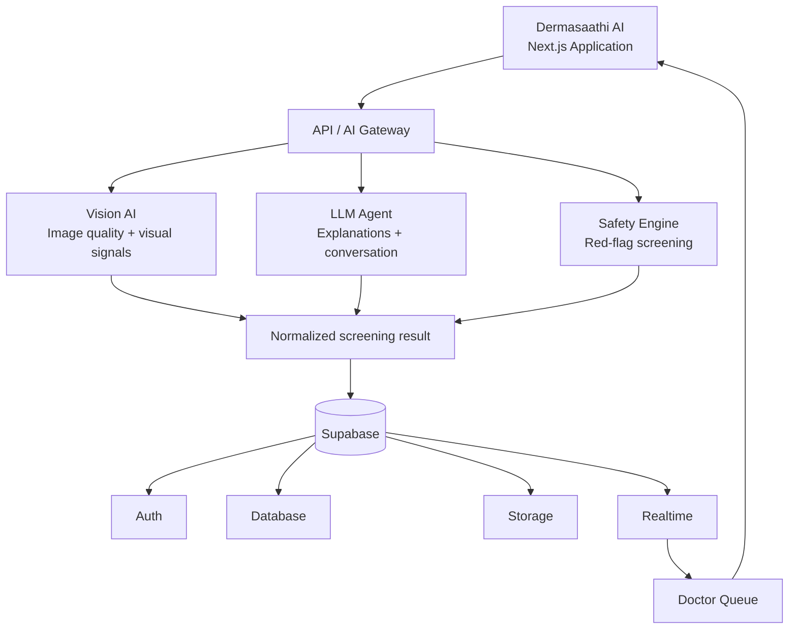
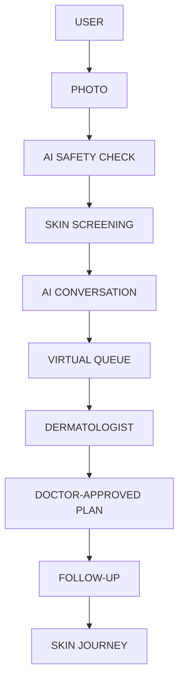

# Dermasaathi AI Architecture

Dermasaathi is a safety-first skin-care companion. The web client is now a Next.js App Router application. AI screening is presented as guidance only and is never a medical diagnosis.

## System map



## Product user flow



The client follows this order deliberately:

1. Capture a multi-angle photo set.
2. Run the safety questions before showing automated skin observations.
3. Show the screening with clear uncertainty and medical disclaimers.
4. Let the user ask questions in the AI conversation.
5. Offer the virtual doctor queue instead of pretending the AI can replace a dermatologist.
6. Keep the doctor-approved plan, follow-up, and skin journey as persistent care history.

## Responsibilities

### 1. Next.js application

- Owns the responsive experience, navigation, scan capture flow, AI assistant, screening summary, safety questions, consultation queue, and skin journey.
- Uses the App Router under `web/app`.
- Keeps browser-only state in the client boundary at `web/src/App.jsx`.
- Presents safe, plain-language observations and links every screening surface to the medical disclaimer.

### 2. API / AI Gateway

The gateway is the only server-side boundary the browser should call. It should:

- Authenticate the current Supabase user.
- Validate file type, size, and scan metadata.
- Create a scan job and return a job id.
- Fan out to Vision AI, the LLM Agent, and the Safety Engine.
- Normalize provider output into one stable response shape.
- Redact provider errors and never expose provider keys to the browser.
- Persist the result only after safety checks complete.

Suggested route groups:

```text
/app/api/scan/route.ts       create a scan job
/app/api/scan/[id]/route.ts  read scan status/result
/app/api/chat/route.ts       stream assistant responses
/app/api/queue/route.ts      read or join the doctor queue
/app/api/queue/events/route.ts  queue event stream
```

### 3. Vision AI

Vision AI should return observations, not diagnoses. It can evaluate:

- Image quality and whether a face is sufficiently visible.
- Broad visual signals such as redness, pigmentation, texture, and oiliness.
- Confidence and an explanation suitable for review by the safety layer.

The result should be stored as structured findings rather than provider-specific text.

### 4. LLM Agent

The LLM Agent is responsible for:

- Translating structured findings into calm, understandable language.
- Asking focused follow-up questions.
- Handling the AI assistant conversation.
- Suggesting low-risk routine guidance only after the Safety Engine passes.

It must not claim to diagnose, prescribe, or replace a dermatologist.

### 5. Safety Engine

Safety checks run before product or routine recommendations. The first version should detect and escalate:

- Severe swelling
- Blisters
- Eye involvement
- Breathing difficulty
- Rapidly worsening symptoms

A positive red flag should stop automated recommendations and surface urgent-care guidance or a doctor handoff.

### 6. Supabase

Recommended data model:

| Table | Purpose |
| --- | --- |
| `profiles` | User identity and consent preferences |
| `skin_scans` | Scan job status, timestamps, and overall result |
| `scan_images` | Storage object references and angle metadata |
| `scan_findings` | Structured observations and confidence values |
| `safety_checks` | Answers, red flags, and escalation state |
| `consultations` | Doctor handoff, patient status, and consultation state |
| `doctor_notes` | Clinician-authored notes and treatment plan |
| `skin_journey_events` | Timeline events shown in My Skin Journey |
| `queue_events` | Position changes and doctor availability updates |

Storage should use a private bucket for original photos. The client should receive signed, short-lived URLs only when required.

Realtime should be used for `queue_events` and consultation status. The browser subscribes to the current user’s consultation channel; it should never subscribe to another patient’s records.

## Data flow: camera scan

1. The client captures Front, Left, and Right images.
2. The client sends image metadata to the API Gateway.
3. The Gateway stores private image objects and creates a `skin_scans` row.
4. Vision AI evaluates image quality and broad visible signals.
5. Safety Engine evaluates red flags and can halt recommendations.
6. LLM Agent creates a plain-language summary from normalized findings.
7. The Gateway persists the safe result and emits scan status updates.
8. The UI shows the screening summary and, when safe, routine guidance.
9. If a red flag is found, the user is offered a doctor queue handoff.

## Privacy and safety rules

- No API keys in client bundles.
- No original images in logs or analytics.
- Explicit consent before storing photos.
- Delete/export controls for user data.
- Every AI result carries the `AI screening ≠ medical diagnosis` disclaimer.
- Any breathing difficulty, eye involvement, severe swelling, or rapidly worsening symptom is an escalation path, not a product recommendation.

## Current implementation status

- [x] Next.js App Router shell
- [x] Responsive Dermasaathi UI and design system
- [x] Guided Front / Left / Right capture flow
- [x] Screening, safety, assistant, consultation, and journey screens
- [ ] Supabase Auth wiring
- [ ] Private image storage
- [ ] Provider-backed Vision AI
- [ ] Provider-backed LLM Agent
- [ ] Server-side Safety Engine
- [ ] Realtime doctor queue
